# De Jure Law Firm
(Developer: Kristina Orlichenko, github: kristaal)
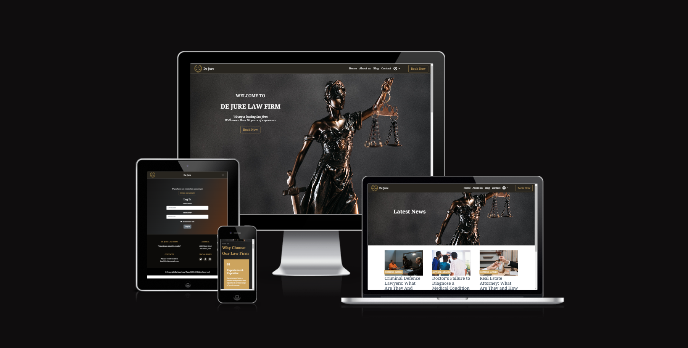
<br>
[Live webpage](https://law-firm-website.herokuapp.com/)
<br>
[Github Repository](https://github.com/Kristaal/Law-Firm-Website)

This project is built as part of the Code Institute Full Stack Software Development course. This is the website for Law Firm. The main goal of this project is to give a user the ability to book consultation at the De Jure Law Firm. User should also get a good feeling for the law firm and know what to expect. If the user books an appointment, they should be able to make updates to their appointments and delete it. Also users have ability to register, read, comment and leave a like on a blog.
<hr>

## Table of Content

1. [Project Goals](#project-goals)
    1. [User Goals](#user-goals)
    2. [Site Owner Goals](#site-owner-goals)
2. [User Experience](#user-experience)
    1. [Target Audience](#target-audience)
    2. [User Requirements and Expectations](#user-requirements-and-expectations)
    3. [User Stories and Site Owner Stories](#user-stories-and-site-owner-stories)
3. [Design](#design)
    1. [Design Choices](#design-choices)
    2. [Colour](#colours)
    3. [Fonts](#fonts)
    4. [Structure](#structure)
    5. [Logic and Database Diagram](#logic-and-database-diagram)
    6. [Wireframes](#wireframes)
4. [Features](#features)
    1. [Book page](#book-page)
    2. [Booking dashboard](#booking-dashboard)
    3. [Blog](#blog)
    4. [Post details](#post-details)
    5. [Home](#home)
    6. [Nav bar](#nav-bar)
    7. [Hero Image](#hero-image)
    8. [About](#about)  
    9. [Testimonials](#testimonials)
    10. [Footer](#footer)
    11. [Contact](#contact)
    12. [Login and Logout](#login-and-logout)
    13. [Admin](#admin)
5. [Technologies Used](#technologies-used)
6. [Bugs](#Bugs)
7. [Validation](#validation)
8. [Testing](#validation)
9. [Security Features and Defensive Design](#security-features-and-defensive-design)
    1. [User authentication](#user-authentication)
    2. [Form Validation](#form-validation)
    3. [Database Security](#database-security)
10. [Deployment](#deployment)
    1. [Local Deployment](#local-deployment)
    2. [Production Deployment Initial](#production-deployment-initial)
    3. [Production Deployment Update](#production-deployment-update)
    4. [Making a Local Clone](#making-a-local-clone)
10. [Credits](#credits)
    1. [Media](#media)
    2. [Code](#code)
11. [Acknowledgments](#acknowledgments)

<hr>

## Project Goals 
This project is built as part of the Code Institute Full Stack Software Development course. This is the website for Law Firm. The main goal of this project is to give a user the ability to book consultation at the De Jure Law Firm. User should also get a good feeling for the law firm and know what to expect. If the user books an appointment, they should be able to make updates to their appointments and delete it. Also users have ability to register, read, comment and leave a like on a blog.

### User Goals 
- Find a law firm that provides good quality and professional legal services
- Book a legal consultation
- Contact and leave a message to the law firm

### Site Owner Goals
- Increase in the number of clients
- Promote the law firm
- Provide a way for new and existing customers to contact the law firm
- Provide a booking system for the possibility to book a legal consultation
- Provide essential information about the law firm 

##### Back to [top](#table-of-content)<hr>

## User Experience

### Target Audience

It might be obvious, but the target audience of this website is people who are looking for lawyers or a professional law firm that will help solve their problem. There may also be people who are looking for a legal blog that can review common issues or questions.

### User Requirements and Expectations
- A simple and intuitive navigation system
- Quick and easy to use
- Links and functions that work as expected
- Good presentation and a visually appealing design regardless of screen size
- Option to book the legal consultation
- Option to view, edit and delete your booked consultations
- Ability to contact and leave a message to the law firm
- Read a legal blog that can review common issues or questions
- Accessibility

### User Stories and Site Owner Stories

User stories and Site Owner Stories were written to fit within the agile methodology. They have the following criteria:

* title
* clear description
* acceptance criteria
* tasks, when acceptance criteria alone weren't clear enough
* story points
* epic
* priority (must have, should have, could have)

To view all the user stories in detail, visit the project page: 

[user stories board](https://github.com/users/Kristaal/projects/9)

### Users

1. As a first time user I can visit a website so that should help me understand what the site is about
2. As a User I can use a navbar and social icons so that I can navigate the site and access socials
3. As a User I can find a footer so that I can move to the social links, see working hours and find an address
4. As a User I can find testimonials so that I can read what clients are saying about company
6. As a User I can find a blog so that I can read regular updated legal posts
7. As a User I can open the post details so that makes me more interested and I can read all information
10. As a User I can view comments on an individual post so that I can read the conversation
11. As a User I can leave a comments so that allows me to participate in a forum-like discussion or leave my opinion
12. As a User I can view the number of likes on each post so that I can see which is the most popular or viral
13. As a User I can like a post so that I can interact with the content
16. As a User I can register an account so that gives me more options as leave comment, like and opportunity to booking
17. As a User I can logout so that can save my data
19. As a User I can contact organization so that I can get in touch with a company
20. As a User I can book a consultation so that I reserve a date and time for consultation
21. As a User I can not book a consultation already booked so that my booking is valid and not double booked
22. As a User I can find booking dashboard so I will see all my bookings
23. As a User I can edit booking so I receive an opportunity to change the date/time of the consultation
24. As a User I can delete a booking so I can cancel my consultation reservation

### Site Owner
5. As a Site owner I can add about us section so that users can find information about company
18. As a Site owner I can add alert messages for users so that users can receive message about their actions
### Admin / Authorised User
8. As a Site Admin I can create, read, update and delete posts so that I can manage my blog content
9. As a Site Admin I can create draft posts so that I can finish writing the content later
14. As a Site Admin I can approve or disapprove comments so that I can filter out objectionable comments
15. As a Site Owner I can add site pagination so users can see splitting list of my website’s blog posts into separate pages

### Kanban, Epics & User Stories

- GitHub Kanban was used to track all open user stories
- Epics were created using the milestones feature
- Backlog, In Progress, Done headings were used in the kanban

<details><summary>Kanban</summary>

</details>

<details><summary>Epics</summary>


</details>

<details><summary>User_stories</summary>

</details>
<br>

##### Back to [top](#table-of-content)<hr>

## Design

### Design Choices
Website design was designed to look professional, clean and modern looking

### Colour
For the colors on the web page, I used dark grays and browns that matched the background image very well and created a nice and cohesive look while still being accessible and providing enough contrast between the foreground and background elements. I also chose the golden color to give the site an expensive look and focus attention

<br>
<details><summary>Colour Pallete</summary>
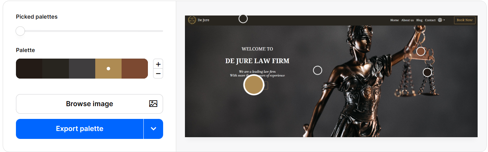
</details>
<br>

### Fonts
For website I chose Noto Serif Lao and Tiro Devanagari Hindi fonts

### Structure
The page is structured in a user-friendly and easy-to-learn way. Upon arriving at the website the user sees the home page, where the purpose of the site is explained. The website consists of 13 separate pages:
1. Home page 
2. About us page
3. Blog page
4. Post details page
5. Booking page
6. Edit booking page
7. Contact page
8. Login page
9. Logout page
10. Signup page
11. 403 page
12. 404 page
13. 500 page

The website is designed to have a natural flow, with a strong focus on the booking functionality, blog section and contact page. Most pages include booking buttons or calls to book an appointment. The home page specifically features a booking button right on top, so a user doesn't have to scroll at all to make an appointment. This is especially handy and necessary for recurring customers, who will be the gross of the clientele. 

### Logic and Database Diagram

The logic of the app was thought out by making a database diagram, to visualize which objects will need to be created for this app to be functional and how they will be connected to each other. Notably, the initial database diagram was incomplete, which was discovered during production of the app. See the images below:

<details><summary>Database diagram:</summary>

</details>
<br>
- Built with Python and the Django framework with a database of a Postgres for the deployed Heroku version(production).
- Five database models was created to show all the content.

- User Model (standard django model) contains the following:
    - user_id
    - password
    - last_login
    - is_superuser
    - username
    - first_name
    - last_name
    - email
    - is_staff
    - is_active
    - date_joined

- PostModel contains the following:
    - ID
    - title
    - slug
    - author (ForeignKey, User)
    - featured_image
    - excerpt
    - content
    - updated_on
    - created_on
    - status
    - likes

- Comment Model contains the following:
    - ID
    - post (ForeignKey, PostModel)
    - name
    - email
    - body
    - created_on
    - approved

- Service Model contains the following:
    - ID
    - service_name
    - price

- Booking Model contains the following:
    - ID
    - user
    - service
    - name
    - email
    - phone
    - date
    - time

- ContactModel contains the following:
    - ID
    - user (ForeignKey, User)
    - first_name
    - last_name
    - email
    - phone
    - message
    - created_date

### Wireframes
The wireframes can be seen below:

<details><summary>All webpage</summary>
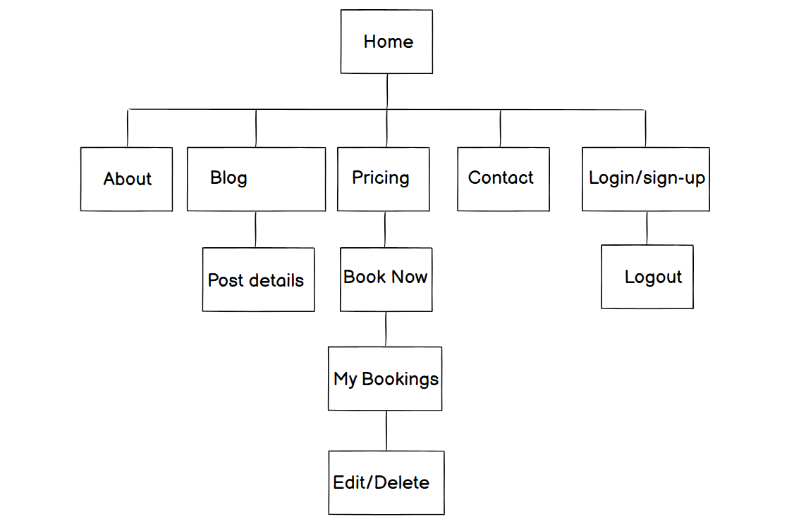
</details>
<br>

<details><summary>Home page</summary>

</details>
<details><summary>About page</summary>
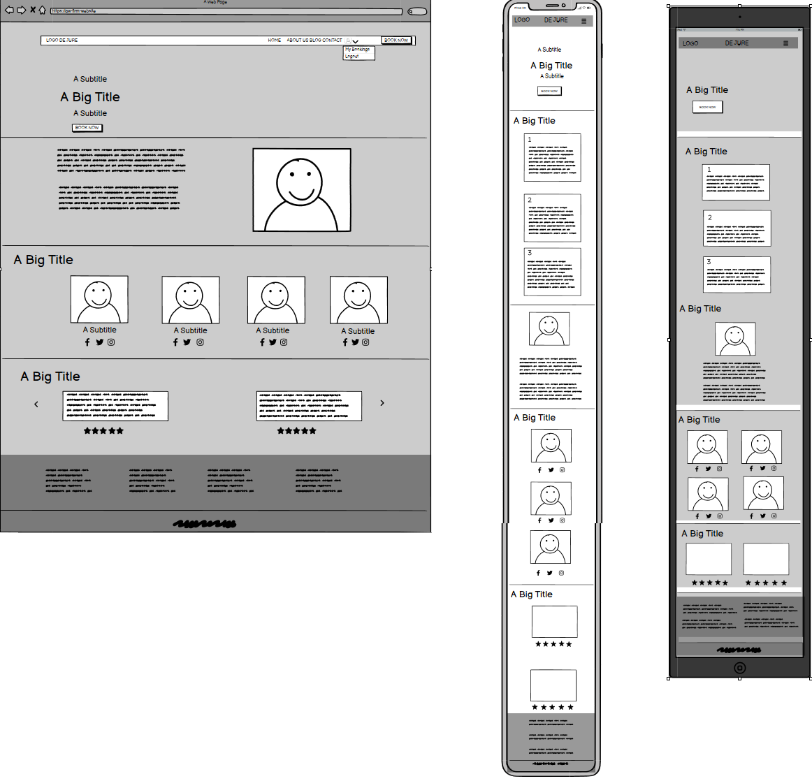
</details>
<details><summary>Blog page</summary>
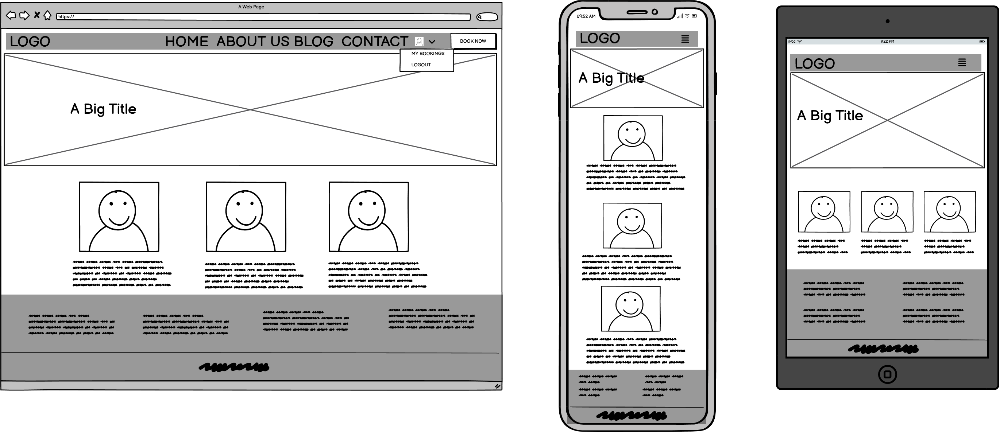
</details>
<details><summary>Post detail page</summary>
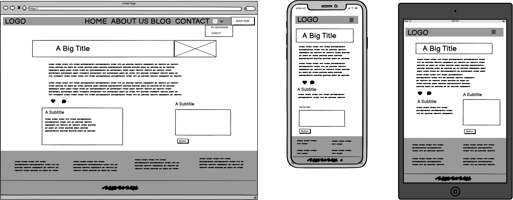
</details>
<details><summary>Contact page</summary>
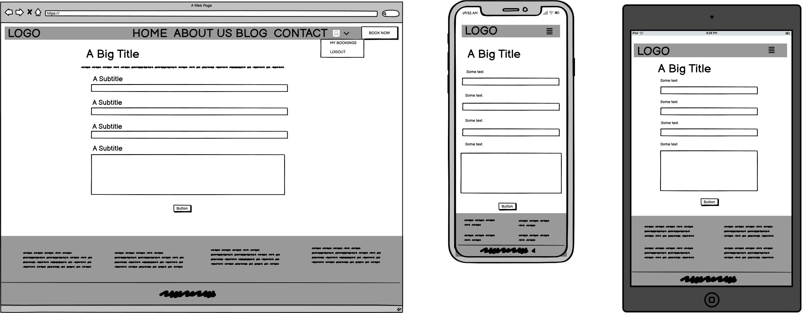
</details>
<details><summary>Booknow page</summary>
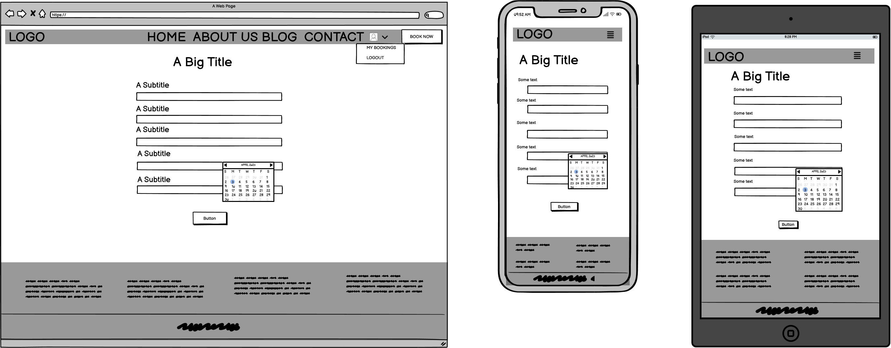
</details>
<details><summary>Bookings page</summary>
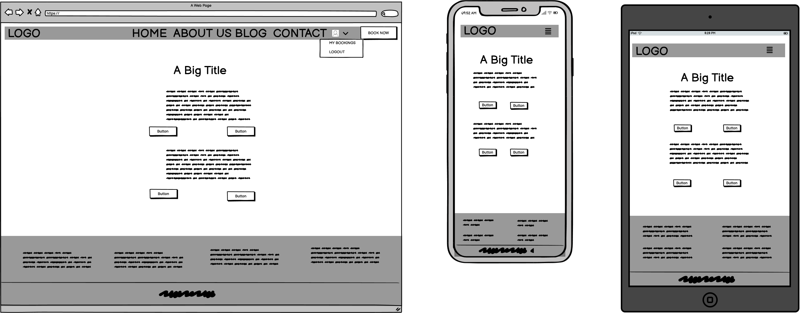
</details>
<details><summary>Sign up page</summary>
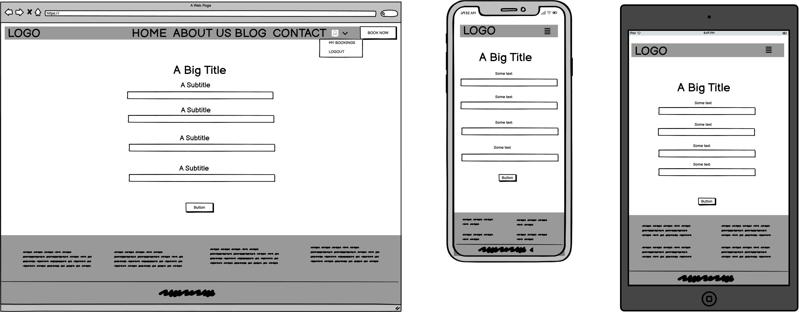
</details>
<details><summary>Login page</summary>
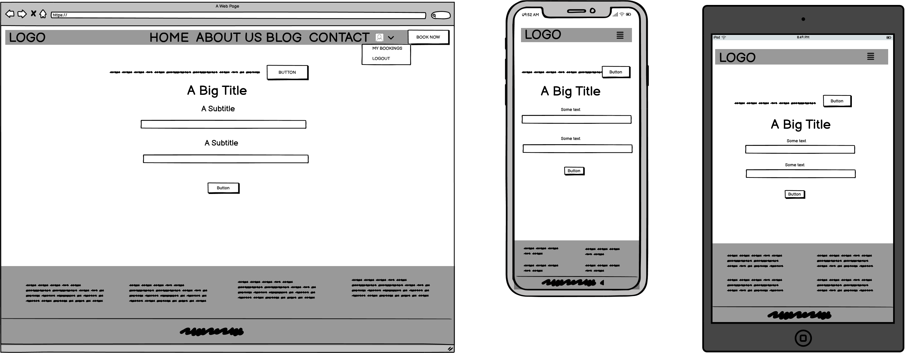
</details>
<details><summary>Logout page</summary>
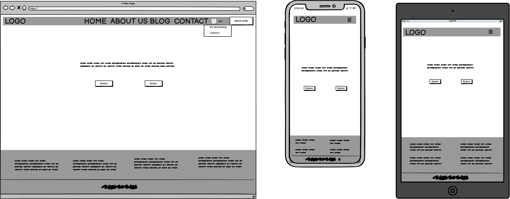
</details>
<br>

##### Back to [top](#table-of-content)<hr>

## Features

The app's biggest feature is of course the booking page and consequently, the user booking page. These two pages are all you need, to book an appointment, cancel the booked appointment or change its date. This is where we will start our journey:


#### ***Book page***

This page is where most users, especially the recurring ones, will spent the grunt of their time. When you first open the page, you will be welcomed by a simple form with datepicker. You are urged to select a service first

<details><summary>Book page</summary>

</details>
<br>

The datepicker will become fully visible and usable and users can select a date. When you select a date, the available times in the time picker will be rendered and user can scroll through the available times. After user picks a time, the time gets entered automatically in the date field of the booking form. The other fields in the form are either auto-filled when user is logged in, or filled in by user upon booking.

<details><summary>Book page selected time/date</summary>
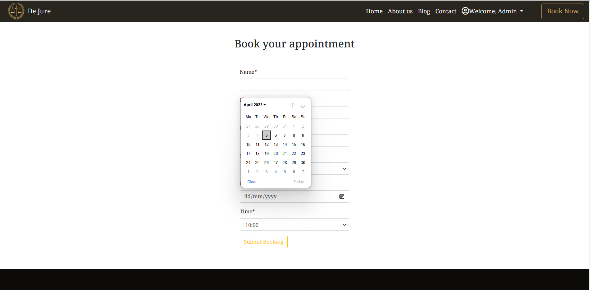
</details>
<br>

After hitting the book button, user will get confirmation of their booking and are urged to go to their booking dashboard.

<details><summary>Book Confirmation</summary>

</details>
<br>

#### ***Booking dashboard***
When the user goes to their booking dashboard, they are greeted a section with all their booked appointments. Which they can expand like an 'accordion' by clicking on the element.

<details><summary>Booking dashboard </summary>

</details>
<br>

When an appointment lays further in the future, user can can delete the appointment by clicking on the delete button.
When delete gets clicked, user will be asked to confirm their choice, by a modal that pops up. This is to make sure the user really meant to click the delete button, since cancelling an appointment by mistake would be very inconvenient.

<details><summary>Booking dashboard delete </summary>
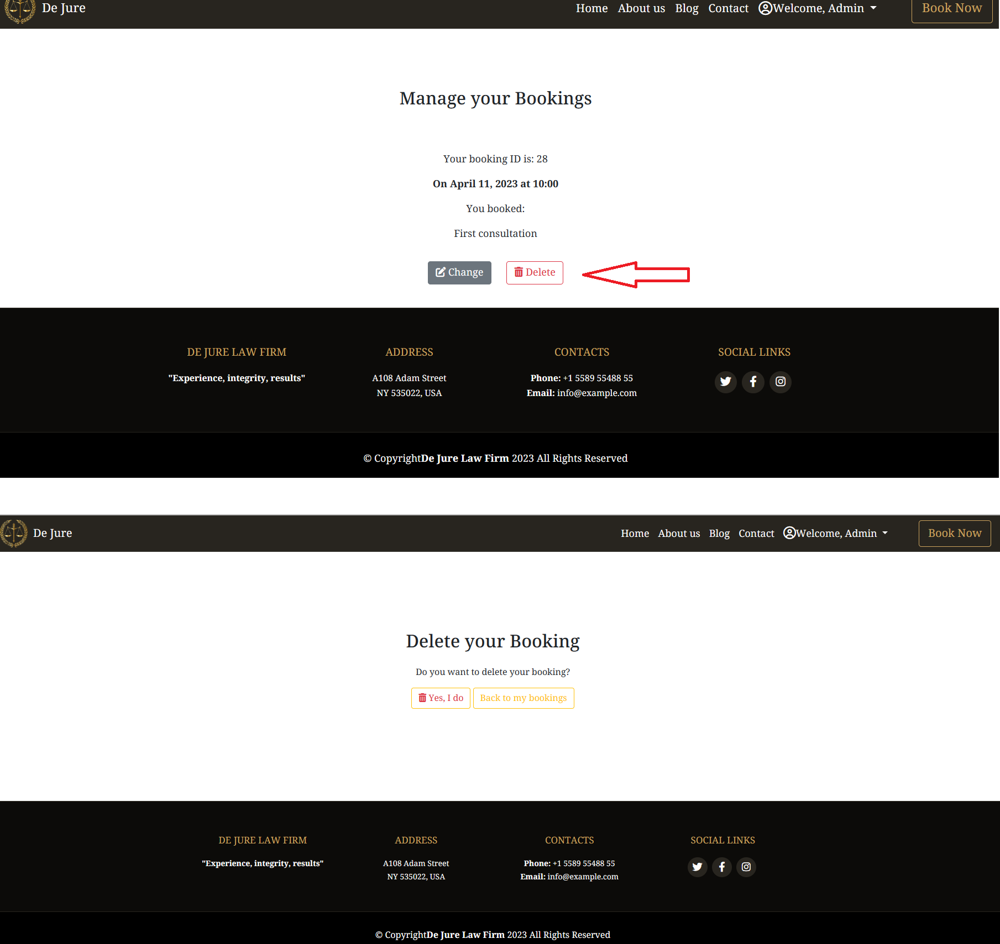
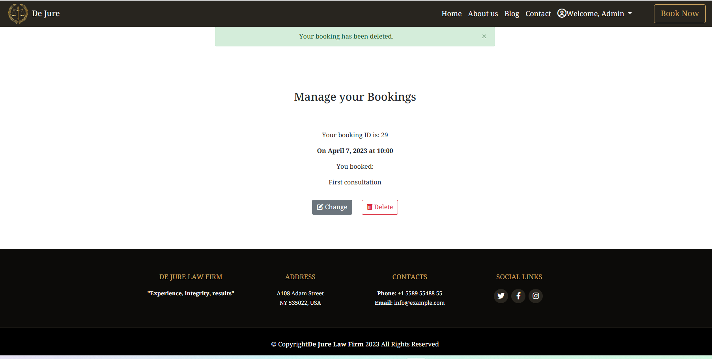
</details>
<br>

The other button present in the appointment accordions is a 'Change date' button. This button will allow the user to change the date or time of the appointment. After clicking the button, they will be redirected to a page similar to the booking page, except the service is pre-selected. 

<details><summary>Booking dashboard edit</summary>
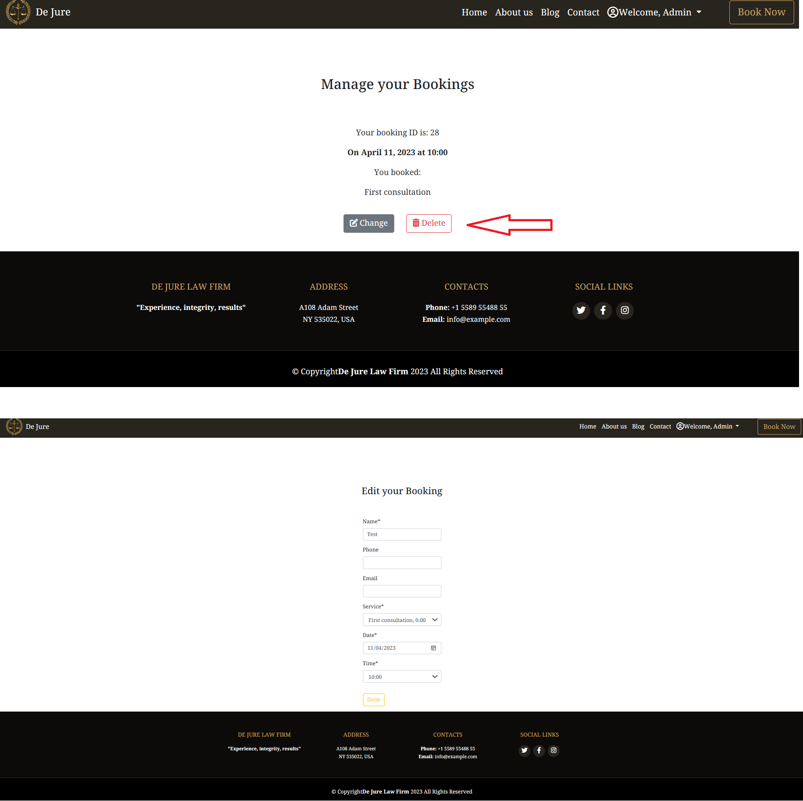
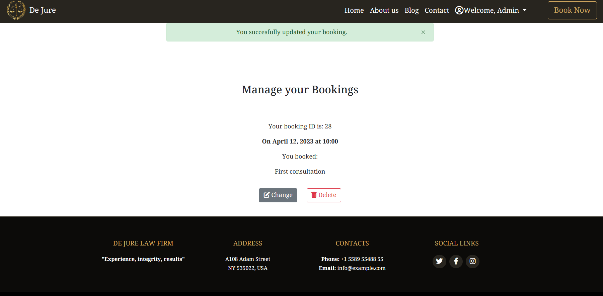
</details>
<br>

#### ***Blog***

The user can find the blog section. The blog is accompanied by a photo selected for the topic of the post, the date of its addition and the number of likes are written. every post is clickable. based on the topic of the post, the user can click on the title and go to the page with this post.

<details><summary>Blog </summary>
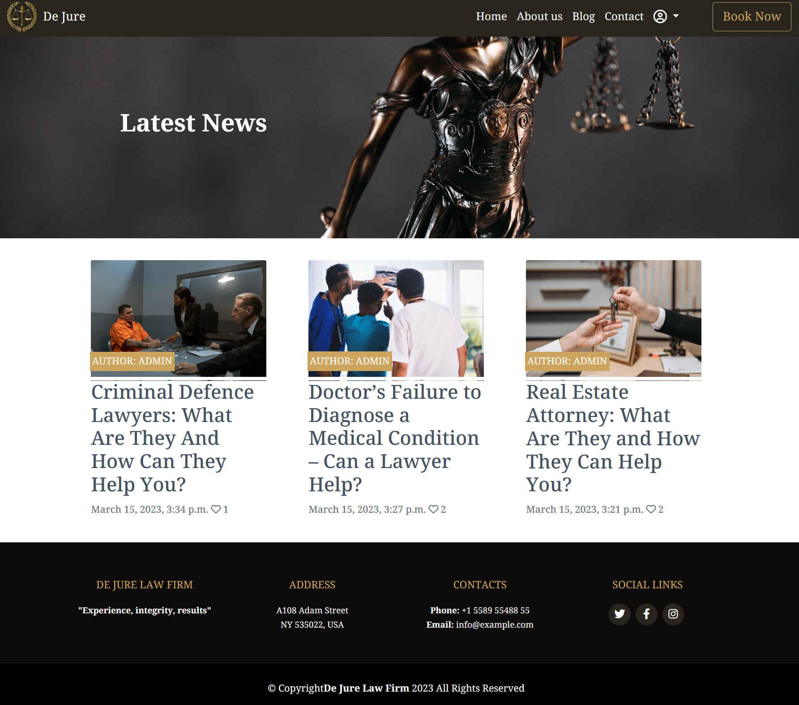
</details>
<br>

#### ***Post details***
After selecting a post, the user can go to a separate post details page that shows the title, post, likes, and comments. The user can also comment on each post if he registers

<details><summary>Post details </summary>


</details>
<br>

After hitting the submit button, users will get a message that their comments is awaiting approval and will soon be added to the site 

<details><summary>Comment confirmation </summary>

</details>
<br>

#### ***Contact***

The contact page displays a simple form for the user to fill out in order to send a message to the owner.

<details><summary>Contact page </summary>
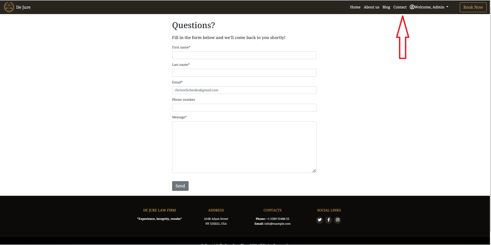
</details>
<br>

#### ***Home***

Let's get on with the rest of the website. The home page features a few elements.

#### ***Nav bar***

At the top of the page you'll find a nav bar with booking buttons. The nav bar will display either a login button, or when user is logged in, their name. When user clicks their name, a menu will pop out with the options to log out or go to their booking dashboard.

<details><summary>Nav bar </summary>
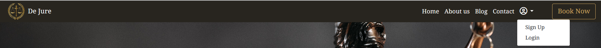
</details>

<details><summary>Nav bar logged in </summary>
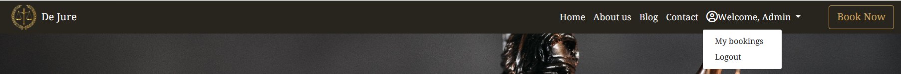
</details>
<br>

#### ***Hero Image***

The hero image will probably be the very first element that catches the users eye when visiting this website. It's a stunning image of Lady of Justice with booking buttons

<details><summary>Hero Image </summary>
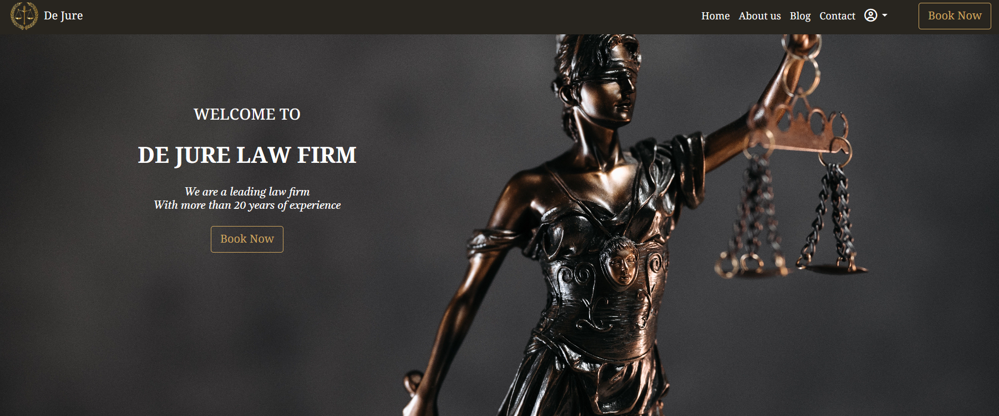
</details>
<br>

#### ***About***

After user scrolls down a bit or choose About link in navbar, they will see the animated "Why Choose Our Law Firm section", than "About us" section and "Our team" section where user can read more about law firm and team

<details><summary>About </summary>

</details>
<br>

#### ***Testimonials***
After user scrolls down home page, user will find a little slider with testimonials 

<details><summary>Testimonials</summary>
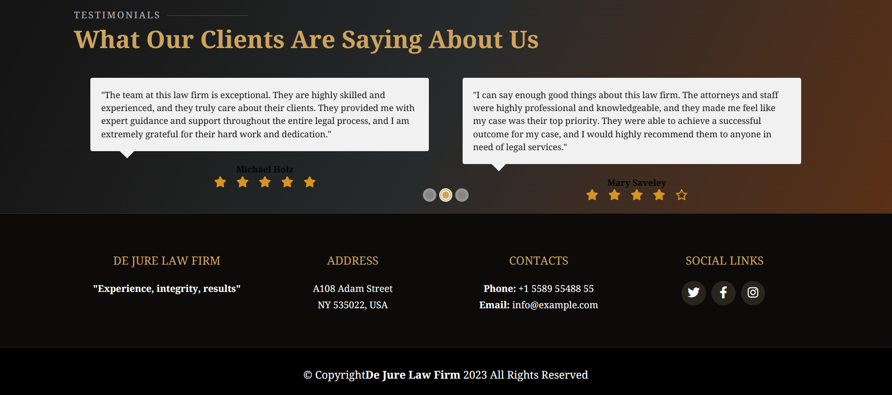
</details>
<br>

#### ***Footer***

At the bottom of the page, there is a footer. The footer houses an address with the location of law firm, some contact info and the social links.

<details><summary>Footer </summary>
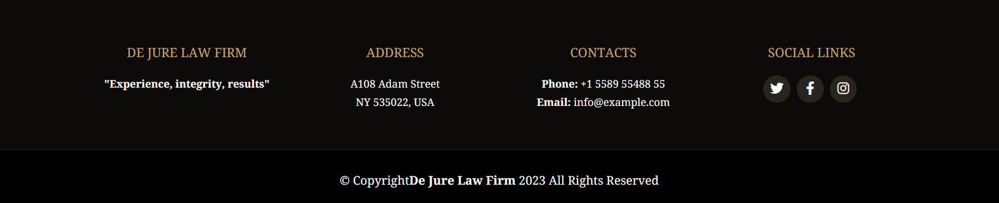
</details>
<br>

#### ***Login and Logout***

The user must create an account to book a consultation or leave comment.
To do this, he is asked to fill out a form on the page with the required fields: username and password. There is also an optional email field.

<details><summary>Sign up</summary>

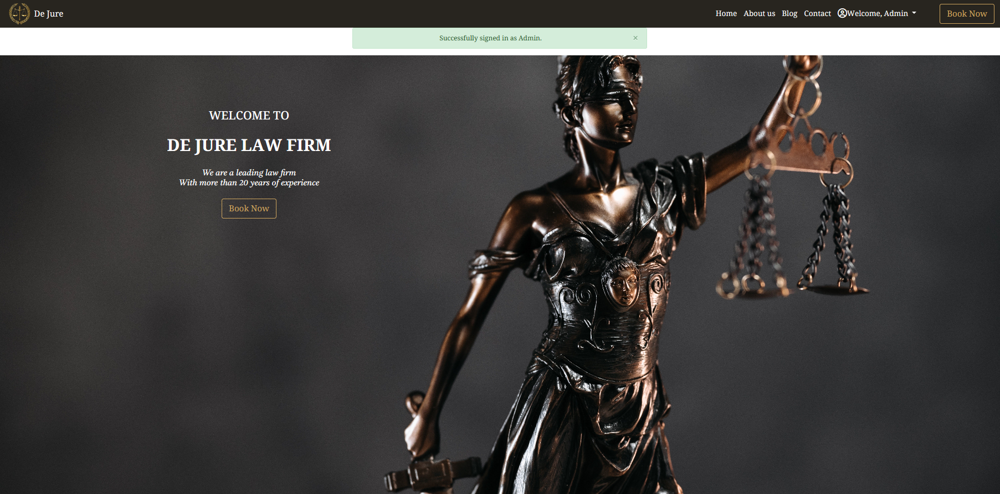
</details>
<br>

A username and password are required to log in existing users.
The user can use the navigation menu. After a successful login, the user receives a message at the top of the screen and is redirected to the page with their bookings. If the user has no bookings, then he sees a message about the absence of orders and an offer to make a booking.

<details><summary>Login </summary>
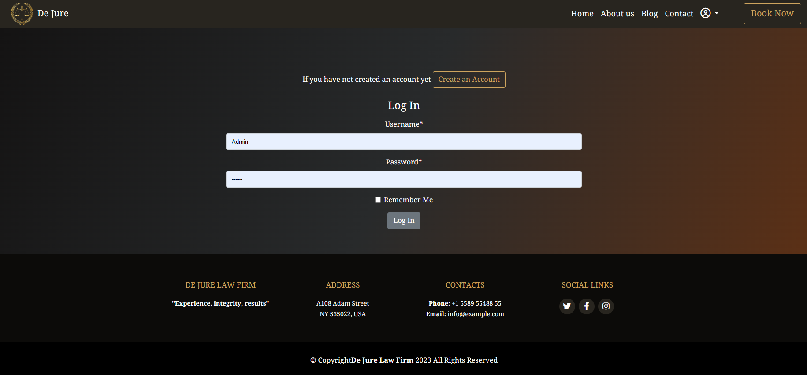

</details>
<br>

Logging out of the account is done through the menu, after which the user is redirected to the logout page where he must confirm his desire to log out of the account. After a successful logout, the user is returned to the home page and receives a message at the top of the screen.

<details><summary>Logout</summary>

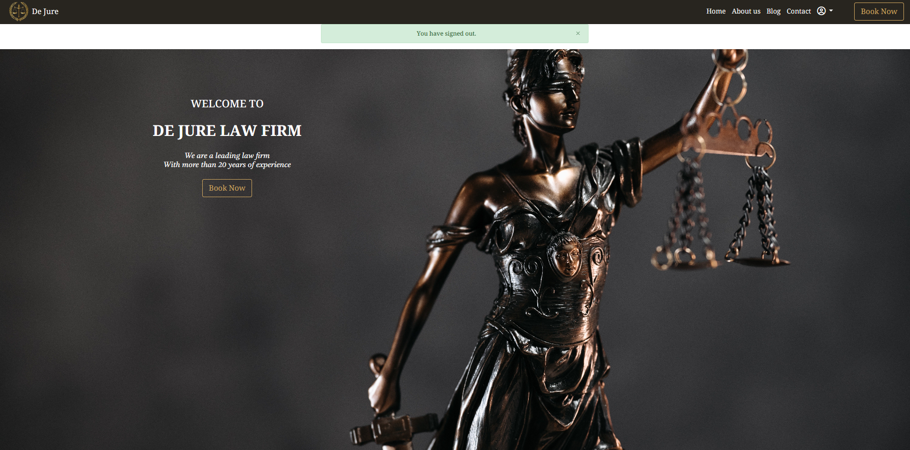
</details>
<br>

#### ***Admin***

Site owner has a lot of control over the website and database entries via the admin panel. The admin can look at registered email-adresses, appointments, contact messages, posts, comments and likes. 
If they login as a superuser, they can edit/delete/add a whole range of objects. Let's have a look at some of them:

<details><summary>Admin</summary>
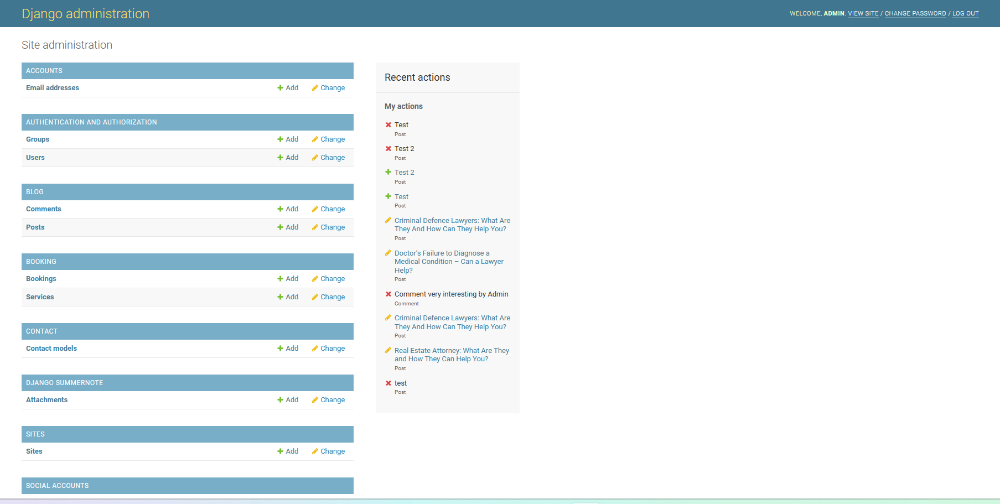
</details>
<br>

After some appointments are booked, you'll see a list of appointments in the admin panel:

<details><summary>Admin bookings</summary>
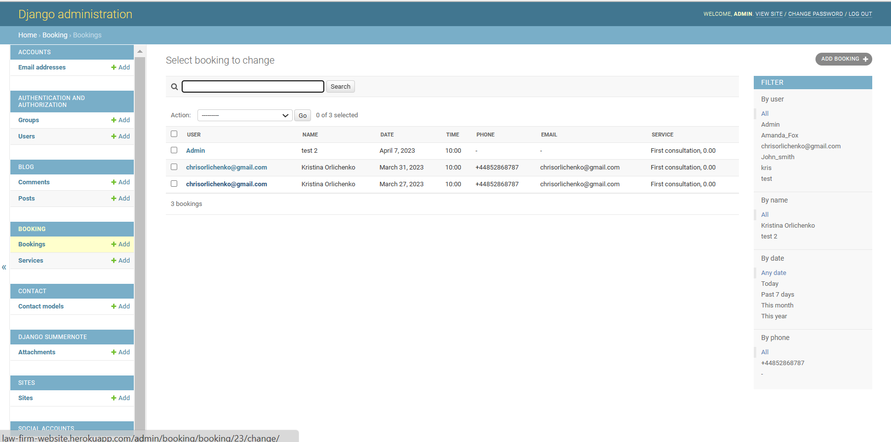
</details>
<br>
Which when opened, look as follows:

<details><summary>Admin bookings edit</summary>
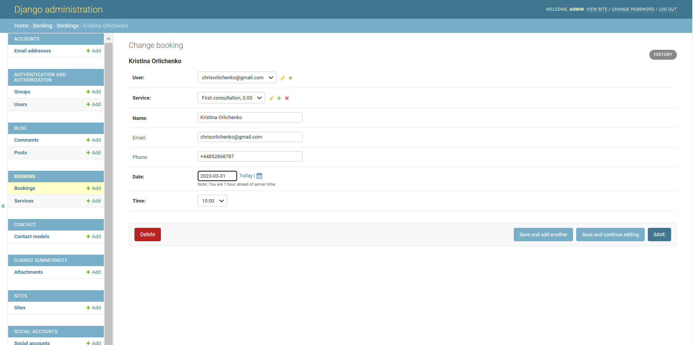
</details>
<br>

As admin you can add all necessary services:

<details><summary>Admin services</summary>
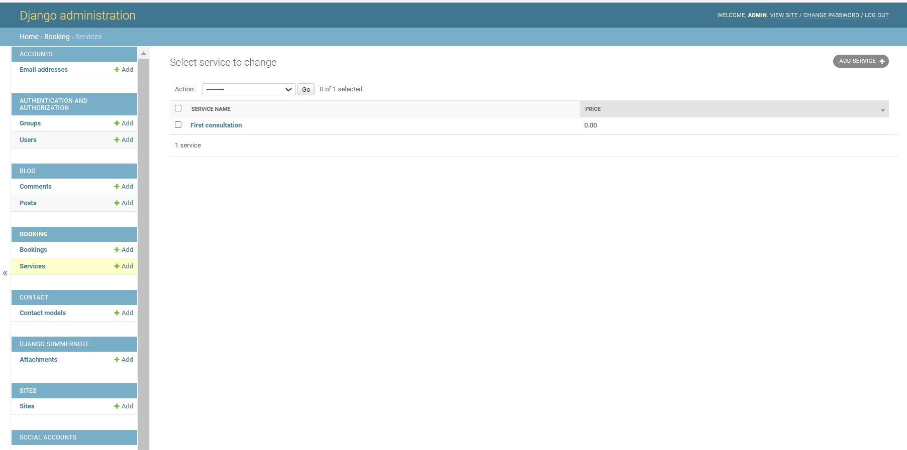
</details>
<br>

As admin you can add a post for a legal blog. You'll see a list of posts in the admin panel:

<details><summary>Admin blog</summary>
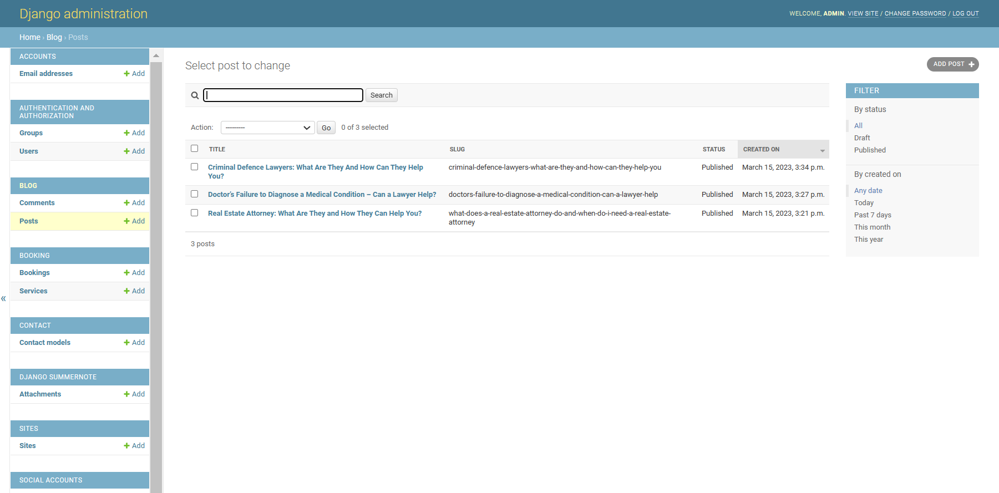
</details>
<br>

Admin always can change or delete each post. Which when opened, look as follows:

<details><summary>Admin post change</summary>
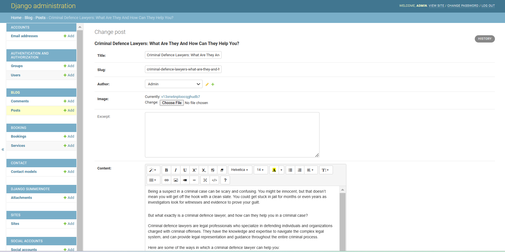
</details>
<br>

All likes left by users admin saw in the admin panel

<details><summary>Admin likes</summary>
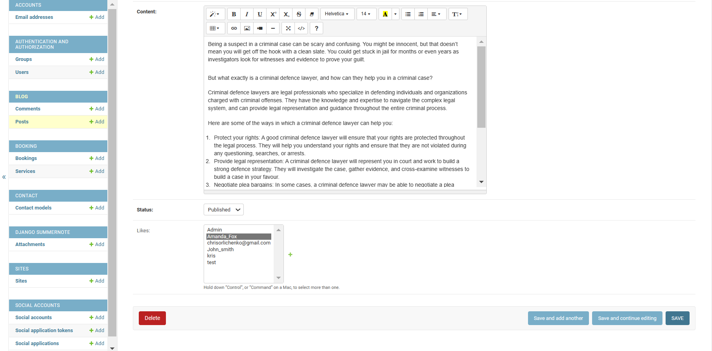
</details>
<br>

All comments left by users are waiting for approval in the admin panel

<details><summary>Admin comments</summary>
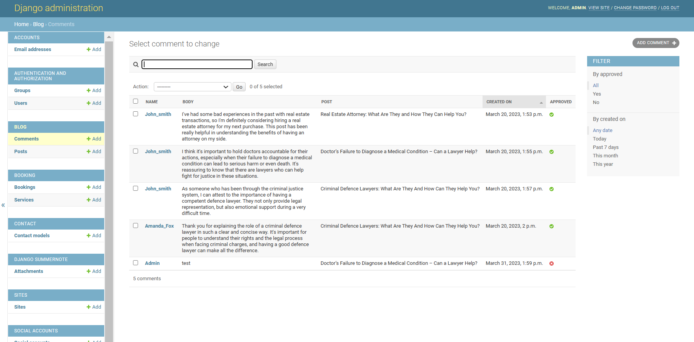
</details>
<br>

Admin can change each comment

<details><summary>Admin comments edit</summary>
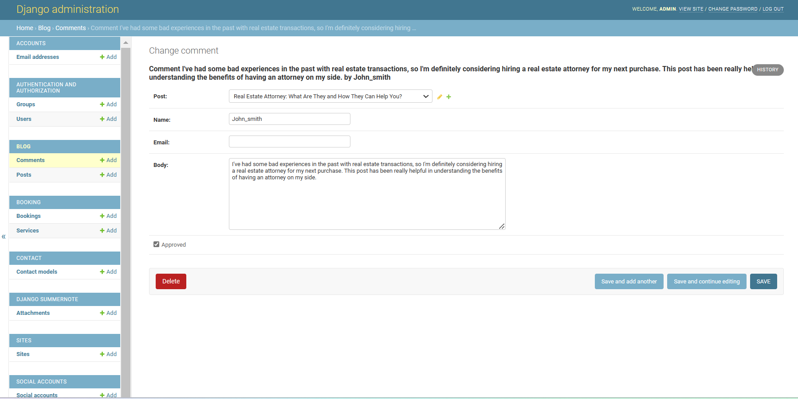
</details>
<br>

After user left a contact message via contact page, admin'll see a list of messages in the admin panel:

<details><summary>Admin contact messages</summary>
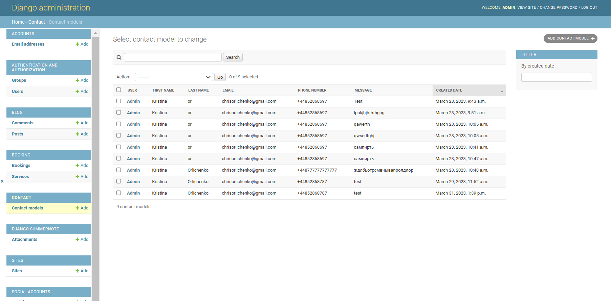
</details>
<br>

Admin can see all registered users

<details><summary>Admin registered users</summary>
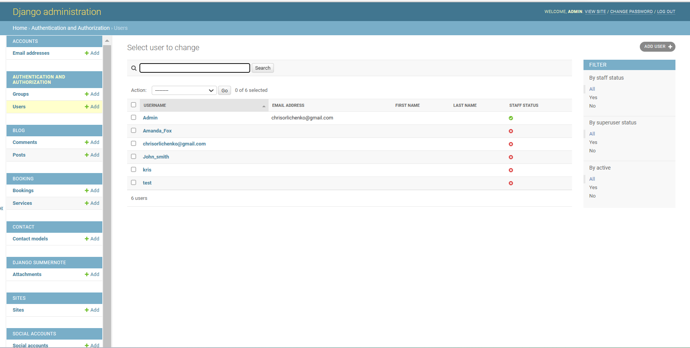
</details>
<br>

##### Back to [top](#table-of-content)<hr>


## Technologies Used

[HTML](https://html.spec.whatwg.org/) - for the structure of the website and mocking of the terminal (written by Code Institute)

[CSS](https://www.w3.org/Style/CSS/Overview.en.html) - to provide styling to the page.

[JavaScript](https://developer.mozilla.org/en-US/docs/Web/JavaScript) - for the structure of the website and mocking of the terminal (written by Code Institute)

[Python](https://www.python.org/) - to write all the logic of the app

[Django](https://www.djangoproject.com/) - used as main framework for the app, which both all backend and most frontend elements are built on.

<br>
The following notable libraries/packages were added to django:

* django-ses: for handling emails with Amazon's SES.
* django-allauth: for handing all user models and login functionality.
* cloudinary: for saving images in cloudinary and serving them to the client.
* django-crispy-forms: for making the django forms look better.

[ElephantSQL](https://www.elephantsql.com/) - used to manage a PostgreSQL database.

[Bootstrap 4.6](https://getbootstrap.com/) - used to style the grunt of the project.

[Jquery](https://jquery.com/) - to make DOM manipulation a bit less painful.

[Lucidchart](https://www.lucidchart.com/pages/) used to make a database diagram.

[Gitpod](https://www.gitpod.io/) - used to connect a browser based VScode to github.

[Github](https://github.com/) - used for version control and deployment of the website.

[Github Projects and Kanban board](https://github.com/users/LarisaLG/projects/17/views/1) - was used to track the progress of the project in general and of every application in the project.

[Heroku](https://dashboard.heroku.com/) - to deploy the app.

[JShint](https://jshint.com/) - used to validate javascript.

[NuHtmlChecker](https://validator.w3.org/nu/) - used to validate HTML.

[W3C CSS validator](https://jigsaw.w3.org/css-validator/) - was used to validate CSS code for the website.

[Multi Device Website Mockup Generator](https://techsini.com/multi-mockup/index.php) - to create an image of the website shown on different devices.

[Google Fonts:](https://fonts.google.com/) - was used to to incorporate font styles. 

[Font Awesome](https://fontawesome.com/) - was used to create the icons used on the website.

[Am I Responsive](http://ami.responsivedesign.is/) - to generate an image showcasing the website's responsiveness to different screen sizes 

[Pip3](https://pypi.org/project/pip/) - is the package manager to install Python modules and libraries

[Gunicorn](https://docs.djangoproject.com/en/4.1/howto/deployment/wsgi/gunicorn/) - "Green Unicorn" is a Python Web Server Gateway to translate HTTP Requests for Python to understand.

##### Back to [top](#table-of-content)<hr>

## Bugs
Extensive testing was done to make sure all the features work as expected. To read all about this, please go to the separate [testing document](TESTING.md).

##### Back to [top](#table-of-content)<hr>

## Validation
Extensive testing was done to make sure all the features work as expected. To read all about this, please go to the separate [testing document](TESTING.md).


##### Back to [top](#table-of-content)<hr>

## Testing

Extensive testing was done to make sure all the features work as expected. To read all about this, please go to the separate [testing document](TESTING.md).

##### Back to [top](#table-of-content)<hr>

## Security Features and Defensive Design

### User authentication

* Django's all auth was used for login and sign up functionality.
* Django's superuser is used to limit access to admin panel.

### Form Validation

Extensive form validation is used on front end as well as backend.

### Database Security

All secret keys connecting the database are stored in a env.py file that is never pushed to github. Furthermore, Cross-Site Request Forgery (CSFR) tokens were used on all forms throughout the project.

##### Back to [top](#table-of-content)<hr>

## Deployment

### Local Deployment

To test the app locally, the terminal within VScode was used. The steps to run this:

* In your project workspace folder, open a terminal
* Run the command: ```python3 manage.py runserver```
* Hit the 'open browser' button or visit ```http://localhost:8000/``` in the browser.
* Use the website as usual.

A local database was used for most of the local deployment usage, since it was necessary for the automated tests to run. However, the switch to using the production database could be easily made, in case migrations needed to be performed or otherwise. Furthermore, in the development version, DEBUG was set to False, so error messages would show follow.

### Production Deployment Initial

Before starting work, the project was deployed to Heroku. This was done early in the process, to prevent having to deal with difficulties of deployment close to the project deadline. The following steps needed to be performed:

#### Create Heroku app:

* Login in to Heroku
* Create a new app.
* Select "New" and "Create new app".
* Give the new app a name and click "Create new app".
* Select a region (Europe for this app).

#### Connect Postgres Database:

* Open your app on the main dashboard of Heroku.
* Open the Resources tab and scroll to the add-ons section.
* Type 'Postgres' and select the Heroku Postgres option.
* Copy the DATABASE_URL in the Config Vars section of the Settings tab.
* To use the Postgres database in your development environment, copy the DATABASE_URL in your env.py file.

#### Deploy App on Heroku:

* Click "Settings".
* Navigate to the "Config Vars" section and click "Reveal Config Vars"
* Add SECRET_KEY variable
* Add CLOUDINARY_URL variable
* Add AWS_ACCESS_KEY_ID and AWS_SECRET_ACCESS_KEY variables.
* Under "Deployment Method" click on "GitHub" to get access to your repository.
* Enable Automatic Deploys" or click "Deploy Branch" to deploy your app.

### Production Deployment Update

Since Heroku stopped offering free tiers on the 28th of november 2022, it was necessary to make a few adjustments to the whole production deployment of the app. 

#### PostgreSQL database:

The Postgres database add-on that was previously used within Heroku was now no longer free and thus a different service had to be used. The choice went to [ElephantSQL](https://www.elephantsql.com/), since they offer a free tier. A [script](https://github.com/Code-Institute-Org/postgres-migration-tool) written by Code Institutes team was used to copy the original database to the new database. The steps are described in the [github readme](https://github.com/Code-Institute-Org/postgres-migration-tool) of that script.

After that, the steps were as follows:

* remove database add on from Heroku.
* remove old DATABASE_URL config var from settings and post new url from ElephantSQL database in its place.
* transform app from free tier to an eco dyno.

### Making a Local Clone
1. Log in to GitHub and locate the GitHub Repository
2. Under the repository name choose button "Code",  click "Clone or download".
3. To clone the repository using HTTPS, under "Clone with HTTPS", copy the link.
4. Open your development editor of choice and open a terminal window in a directory of your choice
5. Type *git clone*, and then paste the URL you copied in Step 3.

``> git clone https://github.com/YOUR-USERNAME/YOUR-REPOSITORY``

Your local clone will be created.

For more information follow this [link](https://docs.github.com/en/repositories/creating-and-managing-repositories/cloning-a-repository#cloning-a-repository-to-github-desktop).

##### Back to [top](#table-of-content)<hr>

## Credits

### Media
[Pexels-Pavel Danilyuk](https://www.pexels.com/collections/lawyer-6ksdigf/) - I used open source Pexels and free images from library Pavel Danilyuk

### Code

* [Code Institute](https://learn.codeinstitute.net/dashboard)- The structure and the code of the project was based on two walkthroughs by the Code Institute: "Hello Django" - I created CRUD functionalities based on the examples of this walkthrough and "From I think  therefore I blog" -  I borrowed confirmation messages code and also followed the site deployment steps outlined here.
* [Stack Overflow](https://stackoverflow.com/) - for research into code functionalities and problem solving. 
* [Codepen](https://codepen.io/features/) -  for the css code used on homepage 
* [Official Django Documentation](https://docs.djangoproject.com/en/4.1/ref/) - for code expressions and code functionalities.
* [Johnny's Barber Shop](https://johnnysbarbershop.ie/) -  as inspiration source for booking platform
* [Date Picker](https://gist.github.com/stasyao/99376eb0cf0ad3599f9737c421b5210e#part_4) - date picker field and minimum date validator
##### Back to [top](#table-of-content)<hr>

## Acknowledgments

### Special thanks to the following:
- Code Institute
- My friends and colleagues with whom I study on the course
- My Mentor Spencer Barriball
##### Back to [top](#table-of-content)<hr>